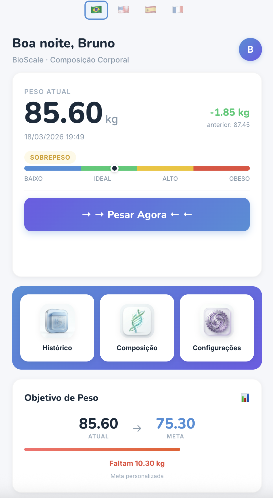
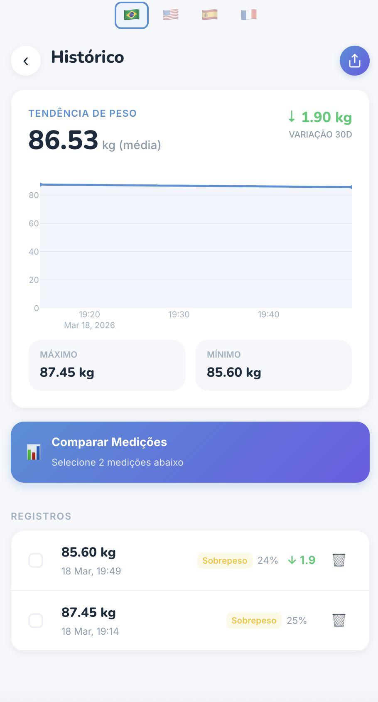
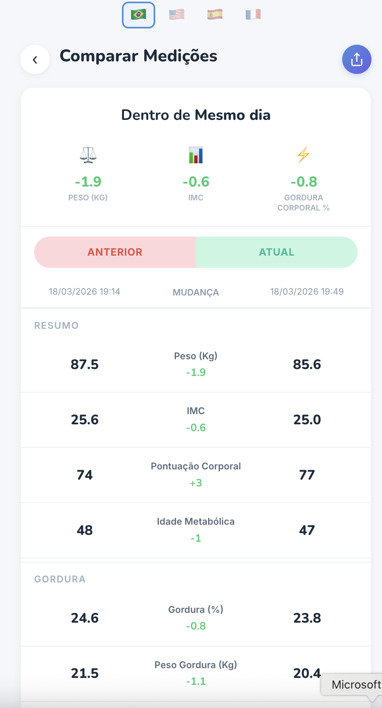
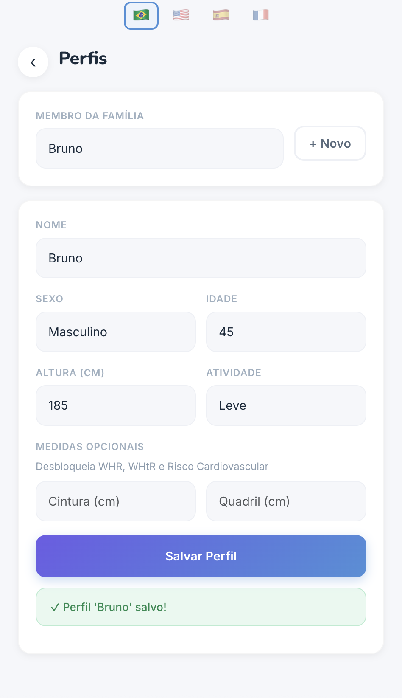
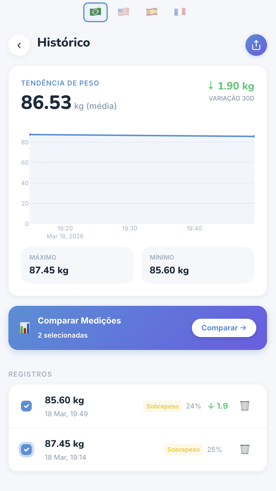
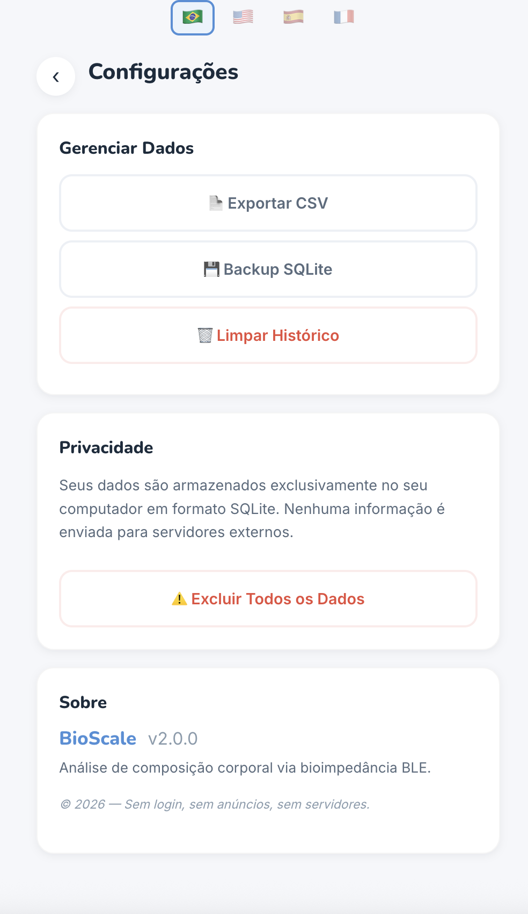

# BioScale — Free OKOK·International Alternative for Body Composition

> **Open-source, ad-free, fully offline body composition analyzer for BLE smart scales (Chipsea chipset). A free alternative to the [OKOK·International](https://apps.apple.com/us/app/okok-international/id1028294311) app. Available as a desktop web app (Python) and a native mobile app (Flutter — Android & iOS).**

<p align="center">
  
  
  
  
  
  
  
</p>

---

## Screenshots

<p align="center">
  
  
  
</p>
<p align="center">
  
  
  
</p>

---

## Why BioScale?

The **[OKOK·International](https://play.google.com/store/apps/details?id=com.chipsea.btcontrol.en)** app (by Chipsea / [okokapp.com](https://okokapp.com)) is filled with ads, locks key features behind a paywall, and uses **inaccurate bioimpedance calculations**. BioScale was built as a **completely free, open-source alternative** that fixes all of that:

- **No ads, no login, no paywall** — all features unlocked from day one
- **100% offline** — your data never leaves your computer
- **4 languages** — Portuguese, English, Spanish, and French built-in
- **Accurate BIA calculations** — formulas derived from reverse-engineering the OKOK CsAlgoBuilder plus validated scientific references (Janssen 2000, Mifflin-St Jeor, Kyle 2004, EWGSOP2)
- **20+ body composition metrics** — more than the OKOK·International app offers, even in its paid version
- **Multi-profile** — support for multiple family members on the same device
- **Cross-platform** — native mobile app (Android & iOS) + desktop web app (macOS, Windows, Linux)
- **Share as image** — share your body composition and comparison results as images
- **Open source** — audit the code, contribute, or fork it

## OKOK·International vs BioScale

| Feature | OKOK·International | BioScale |
|---------|-------------------|----------|
| Price | Free (with paid features) | **100% Free** |
| Ads | Yes (forced video ads) | **None** |
| Login required | Yes | **No** |
| Offline | Partial (cloud sync) | **100% Offline** |
| Languages | Limited | **4 (PT, EN, ES, FR)** |
| Metrics | ~12 (some locked) | **20+ (all unlocked)** |
| Multi-profile | Limited | **Unlimited family members** |
| Data privacy | Cloud sync | **Local only (SQLite)** |
| Data export | No | **CSV + SQLite backup** |
| Open source | No | **Yes (MIT)** |
| Platforms | iOS, Android | **Android, iOS, macOS, Windows, Linux** |
| BIA accuracy | Questionable | **Validated scientific formulas** |

## Features

### Dashboard
- Real-time weight display with BMI classification bar
- Weight goal tracking with progress indicator
- Quick access to History, Composition, and Settings
- Personalized greeting and weight change from previous measurement

### Body Composition (20+ metrics)
- **General:** Body Score, BMI, Obesity Degree, Ideal Weight, Metabolic Age
- **Fat:** Body Fat %, Fat Mass (kg), Visceral Fat Index, Subcutaneous Fat
- **Muscle:** Muscle Mass (% and kg), Skeletal Muscle Mass (SMM), FFMI, SMI, LBM, Bone Mass
- **Other:** Body Water (% and kg), Protein %, Basal Metabolic Rate (BMR)
- **Tier 2 (optional):** Waist-to-Hip Ratio (WHR), Waist-to-Height Ratio (WHtR), Cardiovascular Risk Score

### History & Comparison
- Full measurement history with timeline and weight chart
- Side-by-side comparison between any two measurements
- Track your progress over time with trend indicators

### Multi-Profile
- Create profiles for each family member
- Independent data per profile (name, age, sex, height, activity level)
- Optional waist/hip measurements for cardiovascular risk assessment

### Data Management
- Export data as CSV
- SQLite database backup
- Clear history
- Full data deletion (privacy-first)

### Multilingual (i18n)
- 🇧🇷 Português
- 🇺🇸 English
- 🇪🇸 Español
- 🇫🇷 Français

### BLE Scale Communication
- Native BLE (Bluetooth Low Energy) connection via `bleak`
- Supports Chipsea V1 (FFF0→FFF4) and V2 (FFB0→FFB2/FFB3) protocols
- Auto-scan and connect to compatible scales
- Mock mode for testing without a physical scale

---

## Mobile App (Android & iOS)

BioScale includes a **native mobile app** built with Flutter, offering the same full feature set as the desktop web app — optimized for phones and tablets.

### Mobile Features

- **BLE auto-connect** — scans and connects to your Chipsea scale via Bluetooth Low Energy
- **Real-time weighing** — step on the scale and see your weight update live
- **20+ body composition metrics** — same validated BIA calculations as the desktop app
- **Per-metric color bars** — each metric has its own individual zone gradient (green = healthy, yellow = attention, red = critical, dark green = excellent)
- **Rich descriptions** — tap any metric to see a detailed, layperson-friendly explanation
- **Side-by-side comparison** — compare any two measurements with delta indicators
- **Share as image** — export your composition or comparison screen as an image
- **Multi-profile** — manage profiles for the whole family
- **4 languages** — PT, EN, ES, FR with automatic system language detection
- **100% offline** — all data stored locally on your device (SQLite)

### Mobile Installation

#### Android

Download the APK from the [releases](releases/) directory:

```bash
# Install via ADB
adb install BioScale-v1.0.0-android.apk
```

Or transfer `BioScale-v1.0.0-android.apk` to your phone and install manually (enable "Install from unknown sources").

#### iOS

Build from source (requires Xcode and an Apple Developer account):

```bash
cd mobile
flutter build ios --release
```

Then deploy via Xcode to your device or distribute via TestFlight.

#### Build from source

```bash
cd mobile
flutter pub get

# Android
flutter build apk --release

# iOS
flutter build ios --release --no-codesign
```

### Mobile Tech Stack

| Component | Technology |
|-----------|-----------|
| Framework | Flutter 3.x (Dart) |
| BLE | flutter_blue_plus |
| Database | SQLite (sqflite) |
| Navigation | GoRouter |
| Charts | fl_chart |
| Share | share_plus + screenshot |
| Fonts | Google Fonts (Inter, Nunito) |
| i18n | Custom JSON-based (PT, EN, ES, FR) |

---

## Compatible Scales

BioScale works with smart scales using the **Chipsea chipset**, which is common in many affordable BLE body composition scales sold under brands like:

- Scales that use the OKOK·International app
- Generic Bluetooth body fat scales (AliExpress, Amazon, Shopee, Mercado Livre)
- Any scale advertising compatibility with "OKOK", "OKOK·International", or "Chipsea"

## Desktop App Installation

### Requirements
- Python 3.10+
- Bluetooth adapter (built-in or USB dongle)

### Quick Start (macOS / Linux)

```bash
# Clone the repository
git clone https://github.com/brumathey/bioscale-okok-alternative.git
cd bioscale-okok-alternative

# Option 1: Use the install script
chmod +x install.sh
./install.sh

# Option 2: Manual setup
python3 -m venv venv
source venv/bin/activate
pip install -r requirements.txt

# Run the app
python main.py
# or use the start script:
./start.sh
```

### Quick Start (Windows)

```cmd
# Clone the repository
git clone https://github.com/brumathey/bioscale-okok-alternative.git
cd bioscale-okok-alternative

# Option 1: Double-click install.bat, then start.bat

# Option 2: Manual setup
python -m venv venv
venv\Scripts\activate
pip install -r requirements.txt
python main.py
```

The dashboard opens automatically at `http://localhost:8050`.

### Bluetooth Permission (macOS)

Your terminal app (Terminal, iTerm2, VS Code) needs Bluetooth permission:

**System Settings → Privacy & Security → Bluetooth** → Enable toggle for your terminal.

### Other Commands

```bash
# Scan for compatible BLE scales nearby
python main.py --scan

# Run in mock mode (no physical scale needed)
USE_MOCK_BLE=1 python main.py

# Debug mode
python main.py --debug
```

## Tech Stack

### Desktop (Python Web App)

| Component | Technology |
|-----------|-----------|
| Backend | Python, Flask |
| Frontend | Dash, Plotly, Dash Bootstrap Components |
| BLE | bleak |
| Database | SQLite via SQLAlchemy |
| Data | Pandas, NumPy |
| i18n | Custom (PT, EN, ES, FR) |

### Mobile (Flutter App)

| Component | Technology |
|-----------|-----------|
| Framework | Flutter 3.x (Dart) |
| BLE | flutter_blue_plus |
| Database | SQLite (sqflite) |
| Navigation | GoRouter |
| Charts | fl_chart |
| Share | share_plus + screenshot |
| Fonts | Google Fonts (Inter, Nunito) |
| i18n | Custom JSON-based (PT, EN, ES, FR) |

## Scientific References

- **Body Fat %** — Reverse-engineered from OKOK CsAlgoBuilder (getBFR), with BMI-based fallback (Deurenberg 1991)
- **Skeletal Muscle Mass** — Janssen et al., *J Appl Physiol* 2000 (validated against MRI)
- **BMR** — Mifflin-St Jeor equation
- **Impedance Index** — Kyle et al. 2004 (H²/R)
- **Sarcopenia Risk** — EWGSOP2 thresholds (Cruz-Jentoft 2019)
- **Body Water** — Pace & Rathbun 1945 (73% of FFM)
- **Cardiovascular Risk** — AHA risk factor guidelines, Ashwell 2012 (WHtR)

## Data Storage

All data is stored locally in `~/.bioscale/bioscale.db` (SQLite). Nothing is sent to any server, ever.

## Contributing

Contributions are welcome! Feel free to open issues or submit pull requests.

## License

MIT License — see [LICENSE](LICENSE) for details.

---

## 🇧🇷 Português

**BioScale** é uma alternativa gratuita e open-source ao app OKOK·International para balanças inteligentes Bluetooth (chipset Chipsea). Disponível como app mobile nativo (Android e iOS) e app web desktop (macOS, Windows, Linux). Sem anúncios, sem login, sem paywall, 100% offline. Mais de 20 métricas de composição corporal com cálculos de bioimpedância validados cientificamente. Barras de cores individuais por métrica, descrições detalhadas, suporte a múltiplos perfis familiares e 4 idiomas.

**Palavras-chave:** alternativa OKOK, substituir app OKOK, balança bluetooth sem anúncios, composição corporal grátis, bioimpedância open source, app balança inteligente grátis, OKOK International alternativa, balança Chipsea app, gordura corporal calculadora, IMC massa muscular gordura visceral, app balança android, app balança ios, flutter balança bluetooth

## 🇪🇸 Español

**BioScale** es una alternativa gratuita y open-source a la app OKOK·International para básculas inteligentes Bluetooth (chipset Chipsea). Disponible como app móvil nativa (Android e iOS) y app web de escritorio (macOS, Windows, Linux). Sin anuncios, sin login, sin paywall, 100% offline. Más de 20 métricas de composición corporal con cálculos de bioimpedancia validados científicamente. Barras de color individuales por métrica, descripciones detalladas, soporte para múltiples perfiles familiares y 4 idiomas.

**Palabras clave:** alternativa OKOK, reemplazo app OKOK, báscula bluetooth sin anuncios, composición corporal gratis, bioimpedancia open source, app báscula inteligente gratis, OKOK International alternativa, báscula Chipsea app, grasa corporal calculadora, IMC masa muscular grasa visceral, app báscula android, app báscula ios, flutter báscula bluetooth

## 🇫🇷 Français

**BioScale** est une alternative gratuite et open-source à l'app OKOK·International pour balances intelligentes Bluetooth (chipset Chipsea). Disponible en tant qu'app mobile native (Android et iOS) et app web de bureau (macOS, Windows, Linux). Sans publicités, sans login, sans paywall, 100% hors ligne. Plus de 20 métriques de composition corporelle avec des calculs de bio-impédance validés scientifiquement. Barres de couleurs individuelles par métrique, descriptions détaillées, support multi-profils familiaux et 4 langues.

**Mots-clés:** alternative OKOK, remplacer app OKOK, balance bluetooth sans pub, composition corporelle gratuit, bio-impédance open source, app balance intelligente gratuit, OKOK International alternative, balance Chipsea app, graisse corporelle calculateur, IMC masse musculaire graisse viscérale, app balance android, app balance ios, flutter balance bluetooth

---

**Keywords:** OKOK alternative, OKOK International replacement, OKOK International free alternative, free body composition app, open source smart scale, BLE body fat scale, Chipsea scale app, bioimpedance analyzer, body composition calculator, OKOK without ads, OKOK free alternative, smart scale open source, body fat percentage calculator, BIA calculator, OKOK app alternative, okok international open source, alternativa OKOK, balança bluetooth, báscula inteligente, balance connectée, composição corporal, composición corporal, composition corporelle, flutter body composition app, android scale app, ios scale app
